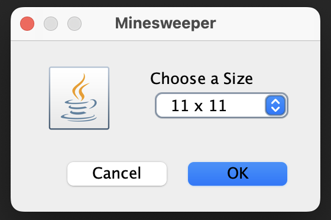
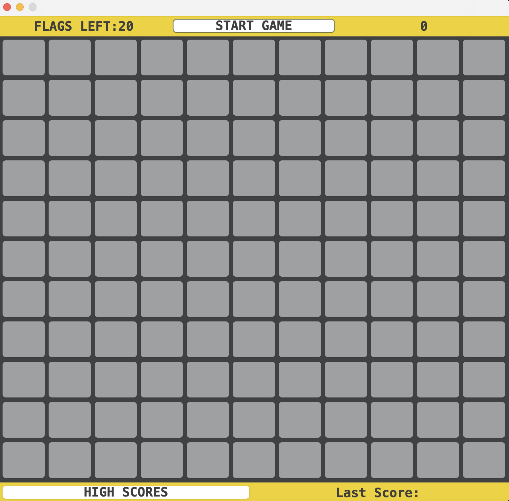
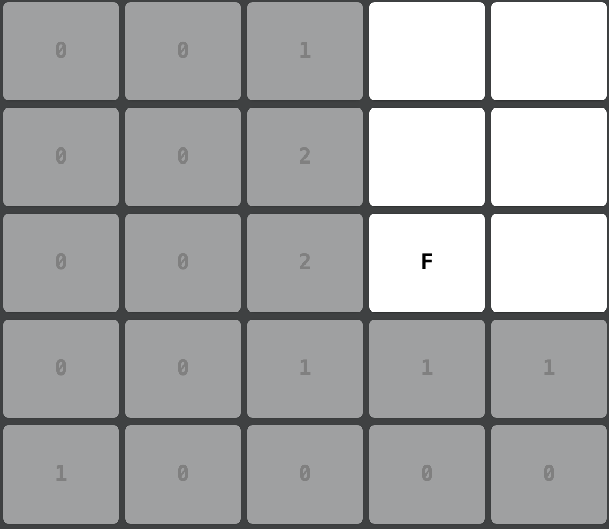
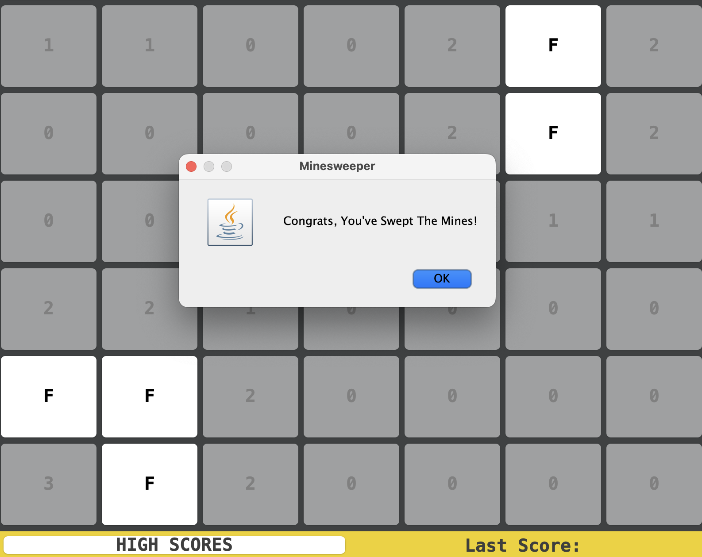
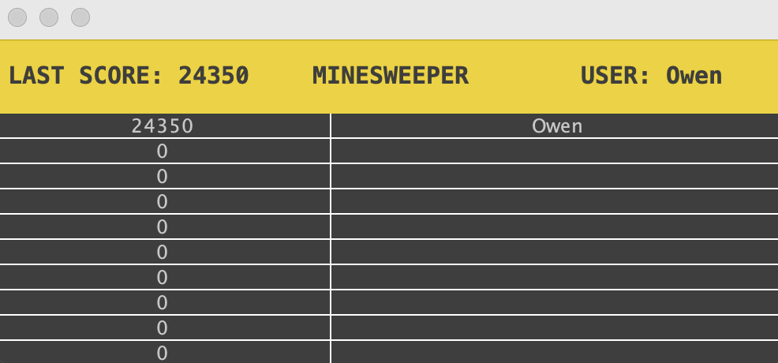

# Minesweeper In Java

A simple minesweeper project in Java using Swing.

To run the application, download ms-owenritchie.jar and click on the file. Select a board size and a difficulty.

  
  
  
  
  

